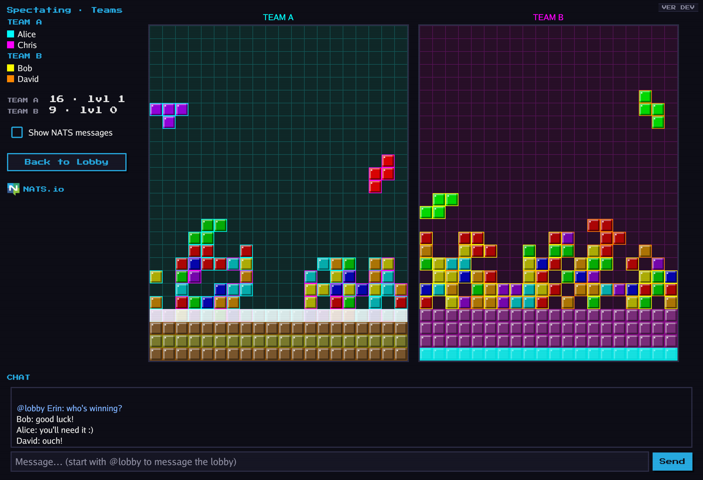
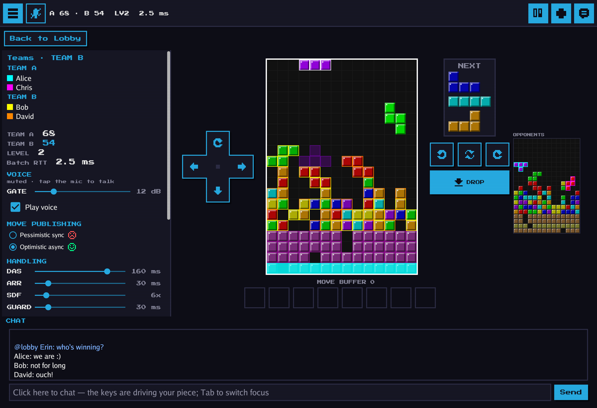
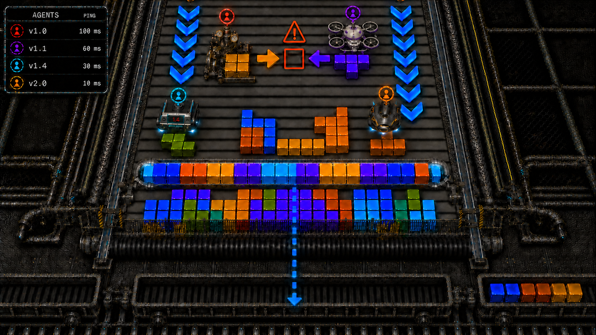

# Jetris



*Spectating a 2v2 teams game with Guideline garbage, a while in: Team A has just completed two lines at once (a double, flashing white) and the garbage line that clear sends under the Guideline table is landing at the bottom of Team B's playfield (flashing in Alice's cyan). The greyed-out rows at the bottom of each playfield are garbage lines from earlier exchanges, each framed in the color of the player whose line clear sent it. Every garbage line comes with one hole, and the lines of one attack line up their holes into a well — fill it and they clear like any other line.*

**An example of a peer-to-peer distributed blackboard system built using 'nothing but [NATS](https://nats.io)' for humans or agents to cooperate or compete towards a common goal and disguised as a fun real-time, multiplayer, guideline-style cooperative/competitive block-stacking game**

Let's get the game part out-of-the-way first: Jetris is a very simple and fun **multiplayer** game. If you know how to play block-stacking games, then you know how to play Jetris, but now there are other players. 

What is unique to Jetris compared to other multiplayer versions of block-stacking games is that you are not competing with others on your own and comparing scores but with or against them, in real-time and on the same playfields!

The cooperative mode: you are working with your teammates to complete lines on the same shared (blackboard system) playfied (that changes in width according to the number teammates). In Jetris two teammate's pieces can _not_ overlap no matter the lag (race conditions cause a colorful flash): players literally have to move around each other to achieve their common goal. 

The competitive mode: there is one playfield per team (that changes in height according to the number of teams) and when one team clears a line, a 'garbage' line gets added to an opponent's playfield (effectively shrinking their playfield's height) — every opponent's in competitive, and one opposing team's, taken in turn, in teams.

Jetris comes in 3 combinations of the above: **cooperative** (one team of n players), **competitive** (n teams of 1 player) and **teams** (n teams of m players).



*The same moment from Bob's (Team B) seat: the garbage line has just landed on his team's playfield, with the opposing team's playfield in the sidebar.*

If you enjoy the game, don't forget to give this repo a star! Thank you!

***How to play Jetris***

To just play the game with others over the Internet you have three options:

Option 1: Nothing to install — open **https://jnmoyne.github.io/jetris/** and hit **Play**: the browser version (WebAssembly) runs right on that page, always the latest release. It plays on a tablet too: on a touch screen the game lays out a thumb-sized D-pad and buttons beside the playfield, so you play by tapping — or by gestures on the playfield, as in the phone versions: swipe left or right to shift the piece, tap the left or right half of the board to rotate it, drag down to soft-drop (the piece still steers), flick down to hard-drop, swipe up to hold. If the WiFi drops mid-game the HUD shows **LINK LOST** with a running clock while the connection is re-established, and the moves you made meanwhile land once it is back — none are lost. That page is served over https, so the NATS server you pick on its login screen has to be reachable over `wss://` — the public `demo.nats.io` server is preselected, and favorites this page can't dial (`nats://`, and plain `ws://`) are greyed out.

Option 2: Download and run the latest release of the `jetris` binary for your platform (pick the right asset from https://github.com/jnmoyne/jetris/releases) and just run it, or clone this repo and build the binary yourself (e.g. `go build -o jetris ./cmd/jetris/`).

If you don't know how to run an unsigned binary you downloaded from GitHub don't worry it's very straightforward, see the following simple instructions for example: Mac OSX https://youtu.be/o4-sX9Tydz0, Windows https://share.google/aimode/MOdkf4QbNr2g9bhZB

Option 3: checkout this repo and build the browser version yourself using `./scripts/build-wasm.sh` then run a local HTTP server for the page (e.g. `python3 -m http.server -d dist/web 8080`), and finally open `localhost:8080` in your Web browser (served over plain http, that copy can also dial `ws://` servers).

***Hosting a game: one QR code, everyone in the same lobby***

If you are the one running the server — a LAN party, a demo, a conference stand — you don't have to talk anybody through the server browser. The desktop build's **LAN party mode** does the whole thing itself: it starts a NATS server inside the game, with a WebSocket listener beside the plain one, *and serves the browser version of Jetris* from the same machine (the release binaries carry it), so the phones on the network need nothing but a page to open. Its lobby's menu column shows both addresses — `http://<ip>:8080` for browsers, `nats://<ip>:4222` for desktop builds and agents — and a **Show QR code** button that puts the join link on the screen as a QR code, over the lobby, until you press OK.

Put the code on the big screen. Everyone scans it with their phone's camera and gets one question — **your name** — over the server's name and address (the tab's **Name** field: "Jetris LAN Party nats server" unless you rename it; it is what every lobby bar, yours and your guests', shows after the @); they type it and land in that server's lobby, browser version and all, having chosen nothing. Typing the `http://` address into a browser lands on the same page. The link is just the join page with the server in its own URL:

```
http://192.168.1.20:8080/join.html?server=ws://192.168.1.20:4223&name=Jetris%20LAN%20Party%20nats%20server
```

For a server of your own — or a page hosted elsewhere — `scripts/gen-qr.go` builds the same link and prints it as a QR code, on the terminal and as a PNG:

```sh
go run scripts/gen-qr.go -name "Demo" wss://demo.nats.io:8443
go run scripts/gen-qr.go                                  # asks for the URL and the name
go run scripts/gen-qr.go -page https://192.168.1.20:8080/ -name "LAN party" wss://192.168.1.20:8080
```

`-page` is where the browser build is served from: the GitHub Pages copy by default (`https://jnmoyne.github.io/jetris/join.html?server=wss://host:443&name=My%20server`), or your own `python3 -m http.server -d dist/web 8080` — the phones have to reach that page as well as the NATS server, so on a LAN give both real addresses rather than `localhost`. The URL must be the server's **WebSocket** address (`ws://` or `wss://`, its `websocket {}` listener), since that is all a browser can dial — and a page served over https can only reach a `wss://` one. No credentials go in a join link: anyone who can see the QR code can read what is in it, so a server that needs a user and password is joined through the login screen. The desktop build takes the same shortcut from the command line: `jetris --server nats://192.168.1.20:4222 --name alice` goes straight to that lobby.

Once you have started the `jetris` binary, you can then pick which NATS.io server to connect to right on the login screen's server browser: select one of your NATS CLI contexts from its CONTEXTS section (it starts on your currently selected context), pick a bookmarked URL from FAVORITES (stored in ~/.config/jetris/favorites.json and pre-populated), add your own, or switch to the **LAN party mode (embedded NATS server)** tab to have Jetris start a JetStream-enabled `nats-server` inside the game process itself (no auth, ports of your choosing — NATS 4222, WebSocket 4223, and 8080 for the page that serves the browser version to the phones — storage in a local `jetstream-data` directory) — the tab shows both URLs, `http://<ip>:8080` for browsers and `nats://<ip>:4222` for desktop builds and agents, so you can share them with the people you want to play with (the lobby then shows the first as a QR code, and desktop players add the second to their favorites). When the page opens every favorite is sized up at once — each row reads *refreshing* meanwhile — and the list is then sorted by ping, the fastest server preselected; each row shows its core NATS ping and how many players and agents are in its lobby right now, clicking a server re-checks it, and the list's **↻ Refresh all servers** row re-checks every one of them whenever you like. You can also use any existing JetStream-enabled server or cluster for which you have credentials (using `nats context` to create contexts for those credentials). And start playing (or spectating)!

A note on latency: Unlike most on-line multiplayer video games which do client-side display of what you see on your screen, by design in Jetris's classic setting (the **Pessimistic sync ☹** side of the HUD's switch, §5.11) there's no client-side pre-updating of what you see on your screen. When you initiate a piece move using your keyboard the desired changes in the playfield are published to the NATS server but your display is not updated at that time. It's only when the server has persisted the messages associated with your move and then sent them back as updates to your machine that the screen gets updated and shows your move and that any subsequent move can be published. This means that the network latency between your machine and the NATS.io server has a noticeable effect on the latency between your player inputs and the playfield you see. This by design and it also means that the latency affects how many 'moves per second' players (and agents) can do. The latency that you see on your screen is not just a network 'ping' latency, it is the end-to-end latency of a transaction getting committed to a stream and stream consumers getting the updated data pushed to them. So if you want to play fast, connect to NATS servers that are not far away from you (or run your own, like in LAN mode). (The switch's other side, **Optimistic async ☺** — the default — pipelines the publishing with predicted sequences and draws your piece where you steer it at once, the acked position outlined behind it; flip between the two to feel what each costs.)

***How it works***
Now that the "it's a game" aspect is out of the way: if you are interested in understanding how Jetris is actually implemented and why it's interesting, then please read on.

Every player runs the same desktop binary. That binary is just a NATS client and a peer to all the others jetris binaries or agents. There is no authoritative 'game server' process computing the game: all of the game logic (collision, rotation, gravity, line clears, scoring, the whole lifecycle) runs *inside each player's client*, and the players coordinate purely by reading and writing a shared stream that lives on a NATS server. The NATS server stores and routes messages — it knows nothing about the game.

***Run and create your own agents***
Since it is a real blackboard system, you are also encouraged to create your own agents (literally, bots) that can play the game against (or with) human players or other agents (there is a default agent included in the `agents` directory), and even contribute them to this repository. Your agents _must_ follow the rules and conventions stated in the Jetris agent guide. Included are simple example agents. While 'playing block-stacking games well' is something relatively easy for software to do, 'playing block-stacking cooperatively *well*' is *much* more challenging. Can your agent(s) top the scoreboard against other agents? How well do your agents work together? What about against teams of humans? There is a lot of room for exploration and fun creating Jetris bots that work well together, and it's fascinating to be able to see what they are doing in real time just by spectating the games.

---

## Table of contents

1. [The idea: a blackboard system](#1-the-idea-a-blackboard-system)
2. [Why this is hard, and why only NATS does it in one primitive](#2-why-this-is-hard-and-why-only-nats-does-it-in-one-primitive)
3. [Architecture: peers, not clients](#3-architecture-peers-not-clients)
4. [The stream *is* the board](#4-the-stream-is-the-board)
5. [The JetStream features Jetris uses, and why each is necessary](#5-the-jetstream-features-jetris-uses-and-why-each-is-necessary)
6. [Walkthroughs with diagrams](#6-walkthroughs-with-diagrams)
7. [Game modes](#7-game-modes)
8. [Build and run](#8-build-and-run)
9. [Watch the blackboard live](#9-watch-the-blackboard-live)
10. [Project layout](#10-project-layout)

---

## 1. The idea: a blackboard system over NATS.io

Each game in Jetris is a kind of [blackboard system](https://en.wikipedia.org/wiki/Blackboard_system): agents players (which can be human) work together towards a common goal on a shared Stream that contains the state of the playfield. Players or teams of players can be evaluated against each other in the competitive and teams play modes. It is a purely 'peer-to-peer' distributed application (on top of NATS): there is no 'game server process' at all, the game is purely executed using the players' `jetris` processes or by agents and purely using the NATS servers for state storage and synchronization.

A blackboard system is an artificial intelligence approach based on the blackboard architectural model: several independent agents share a common, structured knowledge store — the *blackboard* — that they all read from and write to. No agent owns the whole problem; each watches the blackboard, contributes the changes it can, and reacts to what the others have written. The blackboard is the only thing they share, and it is simultaneously the shared *state* and the shared *communication channel*.

In Jetris the blackboard is the playfield, stored as a NATS JetStream stream. The agents are the players. Each player drops their own piece onto a board that everyone shares, sees everyone else's pieces in real time, and must never overwrite another player's move.

### The AI analogy

Replace the humans with software agents and nothing about the architecture changes.

Picture a fleet of warehouse robots, each an autonomous agent, packing boxes of various sizes onto the wagons of a train so they fit together perfectly. To do that as a fleet, each robot needs three things from the shared world, at the same time:

- Shared state: a single common picture of where every box already sits (the blackboard, *and* a form of 'digital twin'). A robot can't plan its placement from a private guess; it has to see the real, current arrangement.
- Concurrency control (CAS): two robots must never drop a box into the same slot, or have accidents by running into each other. When a robot commits a placement, that commit has to be *conditional* on the slot still being empty; if another robot got there first, the commit must fail so the robot can re-plan, not silently clobber. This coordination takes care of detecting (and avoiding) 'race conditions' between agents' actions.
- Real-time push: the instant any robot places a box, every other robot that cares must *see it*, immediately, without polling. Their next decision depends on it.

This analogy is exactly what the Jetris cooperative mode is: a shared board, compare-and-set on every change, and changes pushed to everyone the moment they happen, you can build a multi-agent coordination layer on the same foundation.



*Illustration of a fictional real-life version of Jetris in action.*
---

## 2. Why this is hard, and why only NATS does it in one primitive

The three needs above are each individually well served by various messaging/streaming/data-store systems. The hard part is that a blackboard needs *all three at once, over the same data*. Most stacks force you to bolt two or three systems together and then keep them consistent.

- Plain pub/sub lacks persistence - later joining spectator can't reconstruct the board
- Key/Value stores don't have real-time push to many (or it's a bolted-on channel, not the keyspace itself), and many do not have or have limited per-key CAS.
- Log Streaming systems do not have fine-grained addressing or CAS.
- RDBMS have very limited push ability if any, are not distributed and (comparatively) high latency and not 'real-time'.

NATS with JetStream storage enabled is the only single system, that checks all the boxes.

A single JetStream stream is *at the same time*:
- the event log (every change, in order),
- the materialized current state (the last message on each subject is that subject's current value), and
- the real-time pub/sub fabric (consumers push new messages to everyone the instant they're written).

And the write path itself carries optimistic concurrency control (per-subject CAS) and atomicity (all-or-nothing batches) - and crucially the two can be combined. The subject hierarchy gives you a separate addressable slot for *every cell of the board* with no "topic explosion" cost, plus wildcard subscriptions so each peer streams exactly the slice of the blackboard it cares about.

That combination is why Jetris needs no database, no separate KV, no separate message bus, and no game server.

---

## 3. Architecture: peers, not clients

```
        ┌────────────┐      ┌────────────┐      ┌────────────┐
        │  Player A  │      │  Player B  │      │ Spectator  │
        │   Human    │      │   Agent    │      │   Human    │
        │   (peer)   │      │   (peer)   │      │   (peer)   │
        │            │      │            │      │            │
        │ game logic │      │ game logic │      │ game logic │
        │  lives     │      │  lives     │      │  lives     │
        │  HERE      │      │  HERE      │      │  HERE      │
        └─────┬──────┘      └─────┬──────┘      └─────┬──────┘
              │   CAS writes  +  pushed messages  (over the stream)
              └────────────────┬─┴────────────────┬──┘
                               ▼                   ▼
                  ┌──────────────────────────────────────┐
                  │              NATS server             │
                  │   JetStream: streams + KV, that's it │
                  │                                      │
                  │   stores messages, enforces per-     │
                  │   subject CAS, pushes to consumers.  │
                  │   knows NOTHING about the game.      │
                  └──────────────────────────────────────┘
```

Every human player launches the same `jetris` binary, which connects to NATS as an ordinary client. Agent players connect the same way. All players must obviously be connected to the same NATS server/cluster/super-cluster (and JetStream must be enabled on at least one server) in order to play together. There is no "host." Each peer:

- runs the complete game simulation locally,
- publishes its own moves as batches of compare-and-set writes to the shared stream, and
- consumes everyone's writes via Stream Consumers and applies them to its local board.

Because the authoritative state is *the stream*, all peers converge on the same board. No peer is in charge; the server arbitrates writes (via CAS) but computes nothing. This is what makes Jetris genuinely peer-to-peer rather than client-server.

---

## 4. The stream *is* the board

Each game gets its own stream, `JETRIS_GAME_<gameID>`, capturing the subject space `jetris.game.<gameID>.>`. The trick is that every cell of the playfield is its own subject, and a subject's *last message* is that cell's *current value*.

```
Stream:  JETRIS_GAME_<id>          (subjects: jetris.game.<id>.>)

  subject  (one blackboard slot per cell)              last message = current value
  ─────────────────────────────────────────────       ─────────────────────────────
  jetris.game.<id>.playfield.cell.7.3          →     { occupied, playerIdx: 0, … }
  jetris.game.<id>.playfield.cell.7.4          →     { active,   playerIdx: 1, … }
  jetris.game.<id>.playfield.cell.8.3          →     (never written = empty cell)
  …                                                    …
  ── and, in the SAME stream, the rest of the game state ──
  jetris.game.<id>.meta                        →     { status: in_progress, seed, … }
  jetris.game.<id>.events.<kind>.<playerID>    →     line clears, top-outs (per kind & sender)
  jetris.game.<id>.player.<id>.playfield.garbage →   { total: 3, by: 1 }  garbage rows OWED
  jetris.game.<id>.player.<id>.playfield.txn   →     { applied: 3, op: shrink, … }  rows APPLIED + transform gate
  jetris.game.<id>.roster.<playerID>           →     { name, team, slot }
  jetris.game.<id>.countdown                   →     { seconds: 3 }
```

Chat is the one thing that does NOT live here: the game stream keeps only the
latest message per subject, which would truncate a conversation to its last
line. All chat — the lobby's and every game's — lives in the shared
`JETRIS_CHAT` stream instead, distinguished purely by the game-ID token of
the subject: a game's messages on `jetris.chat.<gameID>` (seen only by that
game's players and spectators, and purged when the game is archived or
deleted), lobby messages under the reserved game ID `lobby`
(`jetris.chat.lobby`).

Two things to notice:

1. The cell subjects are key/value-shaped, so "read the board" means "read the last message of each cell subject". A cell that was never written has no message and is simply empty.
2. Everything else is deliberately shaped so that one-message-per-subject retention loses nothing. Events are scoped per kind AND per sender (`events.line_clear.<player>`, `events.game_over.<player>`), so one player's event can never trim another's; a `line_clear` carries the sender's *cumulative* totals (a newer message subsumes any trimmed older one) and each player publishes exactly one `game_over`. Garbage attacks aren't events at all: each board's `…playfield.garbage` register holds the cumulative rows OWED (attackers CAS-add it, so simultaneous attacks sum) and its `…playfield.txn` register holds the rows APPLIED — both registers are running totals whose latest value is the whole truth, so a peer that lags, reconnects, or joins late reconciles perfectly from the last message. Chat is the one thing that genuinely needs history, which is why it lives in the separate chat stream.

The three game modes use three cell-subject schemes, but the principle is identical:

- Cooperative — one shared board, no player token in the subject: `…playfield.cell.<row>.<col>`. Ownership of a cell lives in the payload (`playerIdx`).
- Competitive — each player owns a private board: `…player.<playerID>.playfield.cell.<row>.<col>`.
- Teams — one shared board per team: `…team.<t>.playfield.cell.<row>.<col>`.

A consumer's subject *filter* then selects exactly the slice a peer wants: its own board, one specific opponent's board, or one team's board — all from the same stream.

---

## 5. The JetStream features Jetris uses, and why each is necessary

### 5.1 Subject-per-cell with last-message-per-subject (state via subjects)

What: Every board cell is a distinct subject; the latest message on that subject is the cell's current state. Reading the board is "fetch the last message of each cell subject". This also allows the optimization of setting max messages per subject to 1 on the stream with deleting of the old message on update, since in this use case we do not care to keep the history of the values of each cell.

Why it's necessary: The blackboard needs *addressable, overwritable state* — "set cell (7,3) to occupied" — not just an opaque event log. Subject-per-cell gives every slot of the board an independent identity that can be written, overwritten, watched, and compare-and-set individually, while still living inside one ordered stream. It is key/value semantics *and* an event log at once.

### 5.2 Per-subject compare-and-set on publish — the keystone

What: Every gameplay write carries a `Nats-Expected-Last-Subject-Sequence` header. The server commits the message only if the named subject's current last sequence equals the expectation; otherwise it rejects the publish (and therefore if the messages is part of an atomic batch, the whole batch fails).

Why it's necessary: This is what makes a *shared, contended* board safe with no central authority. Two players (or a player's own gravity tick and a line-clear) can target the same cell at the same time. Without CAS, the slower write would silently clobber the faster one and the boards would diverge. With per-subject CAS, a write that was computed from a stale view of a cell is *rejected by the server*, and the peer reacts — drop the move and flash the piece (player input), or refetch-merge-and-retry (engine-driven gravity and spawn on shared boards). Because the expectation is per cell subject, concurrent writes to *different* cells never falsely conflict — only genuine same-cell races do. This single mechanism replaces what would otherwise be a server holding locks.

Whole-board transforms — a line-clear collapse, a garbage raise, an elimination vacate — invert the pattern: their cells publish with NO expectations (the transform *overrides* in-flight moves; a raise must never lose to a keypress), and a single **txn register** message at the head of the batch carries the one CAS expectation that gates the whole thing. Two racing transforms — teammates applying the same garbage, a clear racing a raise — resolve atomically: the server rejects the loser's entire batch and it recomputes from fresh state. One expectation, exactly-once semantics, no locks.

### 5.3 Atomic batch publish (all-or-nothing multi-cell writes)

What: The stream is created with `AllowAtomicPublish`; a move is published as a single atomic batch (via orbit.go's `jetstreamext` batch publisher), with each message in the batch carrying its own per-subject CAS expectation.

Why it's necessary: One logical move changes several cells at once — the piece's new footprint *plus* the vacated old positions (≈ 4–8 cells). Consumers must *never observe a torn, half-applied piece*. An atomic batch guarantees either every cell of the move commits or none does. And because the batch's *N* messages receive *consecutive* stream sequences, the publisher can infer each cell's assigned sequence from the single commit ack and advance its own CAS bookkeeping immediately — without waiting to see its own write echoed back.

### 5.4 Ordered push consumers + subject filters (real-time delivery to everyone)

What: Each peer runs several *ordered consumers*, each with a subject filter: its own board cells, each opponent's board, the team board, plus `meta`, `events`, `countdown`, and `roster` on the game stream — and one more on the shared chat stream (lobby + per-game chat, filtered by subject). Messages are pushed in strict stream-sequence order.

Why it's necessary: This is the "push" half of the blackboard — the instant any peer writes a cell, the change is delivered to every peer that subscribed to that slice, with no polling. Ordered consumers guarantee in-order delivery and transparently recover/recreate themselves on hiccups, so each peer can treat its consumer as a clean, gap-free stream of "here's what changed." Subject filters mean a peer subscribes to *exactly* the part of the blackboard it needs (e.g. one opponent's board, or just `meta`) rather than the whole stream.

### 5.5 KV store for the lobby (presence, game listings, and KV-level CAS)

What: The lobby uses a JetStream *KV bucket* (`JETRIS_LOBBY`). Player presence lives under `players.<id>` (refreshed by a heartbeat, pruned when stale); game listings under `games.<id>`; game invitations under `invites.<player>.<gameID>` (written = pending, deleted = accepted/retracted, rewritten `declined: true` = declined — the key's lifecycle is the invitation's state machine, visible to both sides through the same watch). The lobby `WatchAll`s the bucket for real-time updates, and uses KV compare-and-set (`Update(key, value, revision)`) for join and ready-toggle so concurrent joins can't lose updates or two players claim the same team slot.

Why it's necessary: Lobby state is itself a small shared blackboard: who's online, what games exist, who's ready. KV gives last-value-per-key with a watch (the same push model) and revision-based CAS — and it's the *same* JetStream engine over the *same* connection, so presence, listings, and coordination need no extra infrastructure. A KV bucket is literally a stream with last-value-per-subject and a revision = CAS, which is exactly the blackboard pattern again, one level up.

### 5.6 One stream, many subjects: the whole game in a single stream

What: Cells, `meta`, `events`, `roster.*`, and `countdown` all live in the one per-game stream, separated by subject and selected by per-consumer filters. (Chat is the deliberate exception — full-history retention, so it lives in the shared `JETRIS_CHAT` stream under `jetris.chat.<gameID>`, with the reserved game ID `lobby` for the lobby chat.)

Why it's necessary: The blackboard is *one* object with several regions. Keeping them in one stream means a single ordered history for the whole game — so, for example, every peer sees elimination `events` in the *same order* and independently reaches the *same* verdict about who won, with no coordinator. Different concerns are just different subject subspaces of the same board.

### 5.7 `meta` as a CAS-guarded lifecycle state machine

What: The game's lifecycle — `created → starting → in_progress → finished → archived` — is a single subject, `…meta`, whose last message is the current status. Every transition is a CAS publish, and transitions retry on CAS failure.

Why it's necessary: Several peers may try to advance the lifecycle at once (e.g. the last two players top out near-simultaneously; both try to mark the game `finished`). CAS on the `meta` subject ensures exactly one transition wins and the rest no-op — distributed agreement on a state machine, again with no elected leader.

### 5.8 Stream lifecycle: seal, delete, and a shared archive stream

What: When a game ends, its result is published to a single shared `JETRIS_ARCHIVE` stream (which the lobby watches to show recent results) the moment the archiver has built it — before the replay copy, and before a 5 s grace period that lets every peer's consumer receive the final events — and only then is the per-game stream deleted. Startup runs a cleanup pass that reconciles orphaned/abandoned game streams against the lobby KV.

Why it's necessary: Blackboards are created and torn down per task. Sealing freezes a finished game's history; deletion reclaims it. The archive stream is a second, long-lived blackboard of *outcomes*, consumed with the same push model. This keeps resource usage bounded as games come and go.

### 5.9 Replays: copy a finished blackboard into one archive stream, play it back at the recorded pace

What: Before the archiver deletes a finished game's stream, it copies the ENTIRE stream into the ONE shared file-backed `JETRIS_REPLAY` stream, each message republished under `jetris.replay.<gameID>.<original tail>` with its original timestamp riding in a `Jetris-Ts` header, closed by a `jetris.replay.<gameID>.done` marker. A replay is kept while its game is in the *keep set*: the top 10 of its (mode, with/without agents) bucket, ranked by score, or the 25 most recently finished games overall — so you can always watch the game you just played, and the showcase games stay for good. The replay starts where the game did — the recorded `countdown` messages are messages like any other, so the copy holds them and the screen counts them down over the still-empty boards, 5-4-3-2-1-GO just as the players saw it, until the `meta` that moved the game to `in_progress` ends the count and the first cells land. The replay screen keeps the outcome to itself while the game plays back — the players are named in their board colors, no scores, no trophies — and reveals it at the end: the winning board's frame lights up, a WINNER / WINNERS banner rises out of the well and floats under a trophy, the winners' names go gold in bold italic with the scores, the beaten boards read OUT, and the status line names the winner. The trophy is graded by the game's rank in its bucket — legendary (holographic gold) for the bucket's best game, epic (gold in a purple aura) for the top three, rare (silver) for the top ten, a plain bronze cup below that — so the showcase games look the part. The cup holds a tetromino picked by the same rank from the internet's worst-to-best piece ranking — the I for the bucket's best game, then the T, L, J, O and S, and the Z for a game nobody ranks — and spectators get the same reveal live, the moment the game is decided. The game ID sits right after the prefix, so one game is one subject subspace: a single `jetris.replay.<gameID>.>` filter replays it, and a `Purge` with the same filter evicts a game that dropped out of the keep set — no per-game streams to create and tear down. The archiver purges the displaced replays *before* publishing its own marker, so the lobby — which follows the markers with an ordered consumer — treats each marker as "the set changed": the new Replay button appears at once, and one listing reconciles the rest. The history then offers a **Replay** button (games in their bucket's top 10 are marked `TOP 10` once the bucket holds more than ten). Opening one loads the game WHOLE before it plays: one ordered consumer reads the copy end to end as fast as the server will send it (a two-minute game is ~5,000 messages, about 50 ms on a local server, with a progress bar counting off the marker's own message total), and every message is decoded once into an in-memory timeline keyed by the `Jetris-Ts` timestamp it was recorded at. Playback is then a pure function of one number — the playhead — so the screen is a tape deck rather than a stream: play/pause, skip ten recorded seconds either way, jump to the start or the end, half speed to eight times, and a slider that cues straight to any moment. Every one of those is on the keyboard as well — space plays and pauses, ← → skip, ↑ ↓ step through the speeds, HOME and END run to either end, ESC leaves — spelled out in a legend under the deck (a touch screen, having no keyboard, gets the keys of the deck instead). Seeking backwards costs no more than forwards (the boards are rebuilt from empty in tens of microseconds, hundreds of times inside a frame), which is the whole reason to load first and play second. Above the slider runs a timeline of the game's line clears, each marker in the clearing player's board color and taller the more lines went at once, so the shape of the game reads before you press play. The shared boards publish a `line_clear` event the markers are read straight from; competitive boards publish none — a clear there is between a player and their own board — so their markers are read back off the boards themselves, batch by published batch: a falling piece holds nothing, a lock adds four cells, a garbage raise can only push off the top what it just added at the bottom, so a batch that ends up holding LESS lost exactly one row's width per line cleared. Against a real two-agent game that recovers all 26 clears with their line counts matching the archived scoreboard exactly (`TestLiveReplayLoad`).

Why it's necessary: The game stream already *is* a complete, ordered recording of every board change — replay costs nothing but keeping a copy. And it shows the flip side of subject-space design: because the copy keys every message by game ID at the front of the subject, "one game" stays a first-class addressable thing *inside* a shared stream — filterable for playback, purgeable for eviction — the same way one cell is addressable inside a game stream.

### 5.10 Bonus: measuring the loop itself (RTT)

Because every visible board change travels the full *write → commit → consume* loop (publish a batch, the server commits it, the ordered consumer delivers it back), Jetris measures that round-trip continuously and shows it in the HUD. It's not a JetStream feature so much as a window into one: it's the actual latency a player's move pays to become visible to everyone, including themselves.

### 5.11 Lab: hiding the loop — a switch between the two ways of playing it

One switch in a player's HUD (the MOVE PUBLISHING section, while playing), with two settings. **Optimistic async ☺** is the default; **Pessimistic sync ☹** is the game as described everywhere else in this document. (The engine can do more than the switch offers — deeper pipelines, a plain-async mode, an outline-only display; the switch fixes two combinations.)

**Pessimistic sync ☹.** A move's batch is published and its commit ack awaited before the next queued move is taken; the engine never has two of a player's batches in flight. The moves you make during that round trip queue up (the MOVE BUFFER strip) and go out *together as one batch* the moment it returns — so a burst costs a round trip per batch, not per move — and the board paints only what the ordered consumer has delivered: the move appears when it comes back from the stream, and not before.

**Optimistic async ☺.** The batches pipeline with **one in flight**: the next move goes out *right after the previous commit is sent*, and the moves made while a batch is out wait and go out *together as one batch* behind it (the MOVE BUFFER strip shows the moves that will go out together the way the NATS messages panel shows a transaction — a wash of the batch's color behind the arrows and a bracket in that color under them, successive batches in successive colors — and counts the batches; a hard drop or a hold is never grouped — it is a batch of its own). A move is projected from the *optimistic* board (the acked replica with the in-flight batch applied), so a burst pays the round trip once. And the piece is drawn where you are steering it the instant you move it, colored, its hard-drop ghost under it, over the acked board; the piece you steer wears a white outline, and a grey one marks where the **acks** have it so far, trailing behind and moving only as commits ack — client-side prediction, the way most online games do it, with the truth visibly trailing behind. A hard drop never waits: the moment it is made, the steps ahead of it go out as one batch and the drop commits right behind them, from where they leave the piece; the display paints the piece as already dropped, locked where it will land, and the commit paints the same cells.

The catch is CAS, and it is worth understanding because it is a property of the primitive, not of Jetris. A per-subject expectation is an *exact* sequence, and the sequences a batch gets are known only from its ack. So a pipelined batch **cannot know the expectation to carry about a cell an un-acked batch already wrote** — there is no "at least this sequence" and no "only if batch k committed". The optimistic pipeline closes that gap by *guessing*: a cell an un-acked batch wrote carries, as its expectation, the sequence that batch is **predicted** to get — the engine assumes the previous move will not lose its CAS race and that nothing else lands in the stream before it commits, so, a batch's *N* messages taking *N* consecutive sequences after the stream's last, the previous batch's sequences follow from the engine's best knowledge of the stream's end (the highest sequence any of its consumers has delivered, or its own last ack, whichever is later). The predictions live only in the pipeline's bookkeeping: the replica holds actual sequences alone, and every ack and echo overwrites the guess the moment it arrives. A wrong guess — another player's cells, an event, a meta update landing first — makes the next batch's expectations stale, the server rejects it, and the misprediction runs through the same recovery as any lost race, visibly: the first loss flashes the rainbow outline, one repair batch puts the piece back where the stream last agreed it was and vacates the strays (merge-retry on a shared board, so it never writes over another player's mid-flight piece), and the moves pipelined behind the lost one are put back at the head of the queue and go out again from the repaired board — re-projected there, with its actual sequences. A hard drop taken meanwhile yields to that replay and lands from where it leaves the piece; the display reverts to the acked outline with the flash until then. The lost move is the only one the player pays for. That is the trade: full CAS protection while pipelining, at the price of a repair whenever the stream did not do what the engine assumed — a solo board or a slow opponent predicts right nearly always, a busy shared stream does not. (`internal/engine/pipeline.go` carries the full argument, including the shared-board edge: a poisoned vacate can blank a cell another player's piece just moved into; cells carry their piece's anchor, so the owner's next step heals it.)

---

## 6. Walkthroughs with diagrams

### A move: one atomic, CAS-checked batch

A player nudges their piece. The engine diffs the change to just the cells that actually changed, attaches each cell's expected last sequence, and publishes them as one atomic batch:

```
Player A moves left.  Engine diffs → 3 changed cells, each with its expected seq:

      cell 7.3  →  { active A }   expect last seq = 410      (new footprint)
      cell 7.5  →  { empty     }  expect last seq = 409      (vacated)
      cell 7.4  →  { active A }   expect last seq = 412      (commit msg)

        ┌──── atomic batch publish (all-or-nothing) ─────────────┐
        │   msg   cell 7.3   expect 410                          │
        │   msg   cell 7.5   expect 409                          │
        │   commit cell 7.4  expect 412                          │
        └───────────────────────┬────────────────────────────────┘
                                ▼
              server checks EVERY per-subject expectation
                 │
       ┌─────────┴───────────────────────────────┐
       ▼                                          ▼
   all match                                  any stale
   commit → seqs 413,414,415                  reject (10071)
   echoed to EVERY consumer                   move dropped,
   (all peers see the move)                   piece flashes on A's screen
```

### Two peers, one cell: CAS arbitrates

```
   Player A                  cell 7.3  (last seq = 410)             Player B
   ────────                  ──────────────────────────            ────────
   write {A} expect 410 ───►   seq 410 is current    ◄─── write {B} expect 410
                                      │
                         one reaches the server first…
                                      │
                          A wins:  seq → 411, committed
                          and echoed to all consumers
                          (B's consumer applies {A})
                                      │
                          B's write expected 410, but the
                          subject is now at 411  →  10071
                          → B's move is dropped (player input)
                            or refetch-merge-retried (gravity)
```

No lock, no leader — the server's per-subject sequence check is the entire concurrency-control mechanism.

### Joining: snapshot, then resume

```
  Join game
    │
    │ 1. multi-subject direct get: last message of every cell subject,
    │    all bounded to stream sequence S   →  rebuild the full board
    │
    │ 2. ordered consumer, filter = …playfield.>, start = S + 1
    │    (cells + the garbage/txn registers)
    │    every change after the snapshot streams in live
    ▼
  seq:  …  S-2   S-1    S  │  S+1   S+2   S+3  …
        └──── snapshot ────┘  └──── live push ────►
              (state)              (deltas)
```

No update is missed and none is applied twice — the snapshot ends exactly where the live push begins.

---

## 7. Game modes

All three are the same blackboard pattern with different subject schemes and collision rules (full rules: [`jetris-gameplays.md`](jetris-gameplays.md)).

- Cooperative: 2+ players share one wide board (`playerCount × 10` columns), each controlling their own piece. Pieces can't overlap; the shared board uses per-cell CAS with merge-retry so neither player ever clobbers the other's in-flight piece. Score is shared.
- Competitive: each player has a private board (their own subject namespace). Clearing lines owes "garbage" rows to every opponent, recorded by CAS-adding each victim board's durable garbage register — simultaneous attacks sum, and none is ever lost — which each victim applies to its own board as a txn-gated transform. A rising board pushes the falling piece up (minimally), and can eliminate the player. Last player standing wins.
- Teams: two to six teams (the create wizard's Teams slider; two by default), each on a shared per-team board (like a cooperative board per side). Line clears attack an opposing team's board through the same garbage registers — past two teams each attacker rotates through its opponents, so a raise still weighs what it does in a duel; pieces caught by the rising stack are pushed up (cascading through pieces above them), never buried; a team is out when all its members top out, and the last team standing wins. Per-player `game_over` events give every peer the same elimination order, so all peers agree on the winner without a coordinator.

> **Protocol compatibility:** the garbage-register/gated-transform protocol and the per-kind event subjects are a breaking wire change with no version negotiation — every participant of a game (GUI and agents alike) must run a build that speaks the same protocol.

---

## 8. Build and run

### Prerequisites

- Go 1.25+
- A NATS server with JetStream enabled (e.g. run `nats-server -js` locally, or try demo.nats.io). Native desktop UI builds use [Gio](https://gioui.org); on Linux you'll need its system dependencies (see `.github/workflows/release.yml`).
- Optional: the [`nats` CLI](https://github.com/nats-io/natscli) for managing contexts and inspecting streams.
  
- Linux builds need X11/Wayland/EGL/Vulkan dev headers: e.g. `sudo pacman -S vulkan-headers`
- The voice chat's desktop audio ([miniaudio](https://miniaud.io) via cgo) needs a C compiler on every desktop platform — already the case on macOS and Linux for Gio; on Windows that means MinGW-w64 (`gcc` on the PATH). A `CGO_ENABLED=0` Windows build still works, with voice reported as unavailable.

### Build

```sh
./scripts/build-wasm.sh                       # optional but first: the browser version, which the binary embeds and serves in LAN party mode
go build -o jetris ./cmd/jetris
(cd agents/golang-mk1 && go build .)          # optional: the headless computer player (its own module)
```

A `jetris` built without the first step still runs and still hosts LAN parties for desktop builds and agents; it just has no browser version to hand the phones (its lobby says so, and so does the page). `internal/webdist` embeds whatever `internal/webdist/dist/` holds when the binary is built — `scripts/build-wasm.sh` fills it — which is why the release workflow runs that script on every platform before `go build`.

Prebuilt binaries for Linux, macOS, and Windows (amd64 + arm64) are produced on tagged releases by `.github/workflows/release.yml`, which also builds the browser version, attaches it to the release as `jetris-<tag>-web.tar.gz` (for self-hosting) and deploys it to GitHub Pages at https://jnmoyne.github.io/jetris/.

### Browser build (WebAssembly)

The same client also builds for the browser — Gio renders to a WebGL canvas and the game runs unchanged, as a wasm module. The latest release is hosted on GitHub Pages at **https://jnmoyne.github.io/jetris/**: a landing page with a **Play** button (`https://jnmoyne.github.io/jetris/#play` skips straight to the game), redeployed by the release workflow on every tag. To build and serve it yourself:

```sh
./scripts/build-wasm.sh                      # → dist/web/{index.html,join.html,wasm_exec.js,jetris.wasm,screenshot.png,favicon.ico,apple-touch-icon.png,touchtest.html}, and a copy under internal/webdist/dist/ for the desktop binary to embed
python3 -m http.server -d dist/web 8080      # wasm can't load from file://; serve it (the desktop build's LAN party mode serves this same directory itself)
```

Open `http://localhost:8080/` (add `?server=wss://host:port` to preselect a server, the browser build's stand-in for `--server`; `user`/`password` work too, `name=` labels the server, and `player=` gives the player's name — with that one the game skips its login screen and joins the lobby outright). Differences from the desktop build, all behind `//go:build js` files:

- **The join page** (`web/join.html`, `dist/web/join.html`). A link that carries a server — `join.html?server=wss://host:443&name=My%20server` — opens a page whose only question is the player's name, and hands all three parameters to the game page, which connects and goes straight to that server's lobby. It is what the LAN party mode's QR code and the QR codes of `scripts/gen-qr.go` point at, so hosting a game is putting one code on a screen (see *Hosting a game* at the top of this README); a LAN party's server sends its bare `http://<ip>:8080/` there as well, so the address typed into a phone's browser asks the same one question. It refuses, before the ~25 MB download rather than after, what the game would only find out at the end of it: a `nats://` server, a `ws://` one on an https page (mixed content), and a name the game would reject (`config.ValidatePlayerName`). Whatever still fails — the server is down, the name is taken — falls back to the ordinary login screen with the error shown, the name filled in and every other server one tap away. It loads no wasm of its own: the game page carries the touch workarounds a tablet needs, and there is no sense in two copies of them. The auto-join itself is `config.Config.PlayerName` (`--name` on the desktop): the login screen plays its own Play button on its first frame, once.

- **Transport is WebSocket.** A browser has no TCP sockets, so nats.go is given a custom dialer that speaks the raw NATS protocol over a browser `WebSocket` (`internal/nats/transport_js.go`, `wsconn_js.go`) — the same thing the official `nats.ws` client does. The server you connect to must have a `websocket {}` listener; `nats://` URLs are dialed as `ws://`, `tls://` as `wss://`, and `ws(s)://` as given. A page served over https (the GitHub Pages site) may only open `wss://` — the browser refuses plain `ws://` from a secure page. The favorites are the same six as on the desktop, but the rows this build can't dial are greyed out and can't be selected (nor added): the `nats://` ones always, and on an https page the `ws://` ones too, so there `demo.nats.io` (`wss://`) is the default selection.
- **No LAN party mode** — a wasm module can't listen for connections, so the tab is hidden and nats-server isn't linked in (the module is ~25 MB before compression). It is the other way round that works: the desktop build carries this module (`internal/webdist`) and serves it to the phones in LAN party mode.
- **No NATS CLI contexts** (no filesystem); favorites persist in the page's `localStorage` instead of `~/.config/jetris/favorites.json`.
- **Touch on iPad — a WebKit workaround.** Gio's touch handlers call `canvas.getBoundingClientRect()` on every touch event, a synchronous layout in the middle of the gesture; on iPad (Safari and Chrome alike — both are WebKit there) a fast flick, the hard-drop gesture, then left WebKit delivering no touch events at all to the page for several seconds, until the finger had stayed off the glass. The page (`web/index.html`) answers that call from a cache while a touch handler runs, kept warm outside the handlers, and holds the frames Gio requests during the first 60 ms of a touch until those 60 ms have passed, so a flick's whole sequence is delivered before a frame (15–40 ms of WebGL on an iPad) can hold its events up; together these took the blackouts from seconds to well under one. The rest was Gio's: a frame parked on the engine lock during the next piece's spawn (a NATS round trip) hands the wasm event loop back to the browser, and Gio discards input that arrives mid-frame — so the page also holds input delivered inside a frame until the frame has ended (`frameBegin`/`frameEnd` in `view_js.go`), which is what saved the swipe made right after a hard drop. `?nocacherect=1` turns the cache off and `?delayframe=0` the frame delay, to see the difference.
- **Touch diagnostic.** Should touch input misbehave on some tablet, open the page with `?touchdebug=1`: a badge in the corner counts every touch, pointer, mouse, gesture and scroll event the page receives (a `pointercancel` means a native gesture took the touch over), the fingers seen at once and the idle time since the last touch, beside what the game reports every frame (touch presses that reached the game screen, frames laid out, moves queued), the page's zoom, selection, focus and visibility, and a trace of the latest events — enough to tell whether touches stopped reaching the page, arrived as something else, stopped reaching the game, or went nowhere. `touchtest.html` beside it is the same badge on a plain page with the game page's CSS and Gio's touch handling (no wasm, no WebGL) — with `?busy=200` (a busy frame after each touch), `?nopd=1` (no `preventDefault`) and `?pointer=1` (pointer events) variants — to tell a browser/OS behaviour from a game-page one.

### Run

Jetris never connects at startup — the login screen is where you choose the connection. Type your name at the top, pick a server in the **CONNECT TO** page, and hit the big **Play** button at the bottom. The page has two tabs:

- **NATS server browser:** a file-picker-style tree of servers. **FAVORITES** holds your bookmarks — pre-populated with the Jetris servers `Jetris EU central`, `Jetris AP south` and `Demo.nats.io (US central)`, each listed twice: over WebSocket first then over plain NATS (`nats://…:4222`); the browser build greys the `nats://` rows out, as it can't dial them — which you add to with **+ Add a NATS URL…** (a label is optional), delete with each row's ✕, and put back as shipped with **Reset favorites…** (it asks first: the current list is replaced by the defaults); they persist in `~/.config/jetris/favorites.json` (or under `$XDG_CONFIG_HOME` or in your browser). **CONTEXTS** lists your NATS CLI contexts (the same contexts the `nats` CLI uses, your current one marked "(nats CLI current)"). The first favorite starts selected. Click a row to select it — the selected row lights up as a solid blue band, and a **SELECTED** line under the list repeats its name and URL, so what Play will dial is never in doubt — and the click sizes the server up before you join (clicking it again re-checks it, and the list's first row, **↻ Refresh all servers**, re-checks every server — favorites, contexts and the `--server` row — in one round): Jetris really dials it, measures its **Core NATS ping** — the round trip of an actual message published to an inbox and received back from the server — and looks at the server's lobby to count the players currently connected there, reporting `✓ <server> · Core NATS ping 38 ms · 3 players online` (each row also keeps a compact `38 ms · 3 online` / `OFFLINE` readout). Nothing is joined or created by a refresh.
- **LAN party mode (embedded NATS server):** Jetris starts a JetStream-enabled `nats-server` inside the game process itself — default account, no auth, JetStream data in a local `jetstream-data` directory — with a plain NATS listener *and* a WebSocket one, plus an HTTP server beside it that serves the browser version of Jetris (embedded in the binary), and connects to it. The name, the IP and the three ports are editable: the **Name** ("Jetris LAN Party nats server" by default) is what the lobby bar reads after the @ — yours and, through the join link, every guest's — the IP is pre-filled with your machine's auto-detected LAN address, the ports with **NATS 4222**, **WebSocket 4223** and **HTTP 8080**, and no two may be the same. The tab shows both URLs — "Browsers open `http://<ip>:8080`" and "Desktop builds and agents dial `nats://<ip>:4222`" — so you can share them before even hitting Play; override the IP when the detected one isn't the address your friends can reach (multiple network interfaces, a VPN, a container). The servers always listen on *every* interface, so the IP field only changes which address Jetris advertises and connects through. **Check embedded server** first checks that all three ports are free (a port something else holds is named at once: "port 4223 (WebSocket) is already in use"), starts the servers, and really dials all three over that address — a NATS ping over the plain listener and over the WebSocket one, an HTTP GET of the page — reporting `✓ serving on nats://<ip>:4222 · ws://<ip>:4223 · http://<ip>:8080 · Core NATS ping 0.3 ms · no lobby yet`. Once in the lobby, the menu column repeats the two URLs and adds **Show QR code**: a window in the middle of the screen with the join link as a QR code (and the link under it), dismissed with OK — phones scan it, type a name, and are in. The servers keep running until you close the window, so quitting to the login screen doesn't kick your friends; changing a port on a later login restarts only the server whose port changed.

- **The LAN party page is https.** Browsers give a page its microphone only over https or `localhost`, and a phone on the LAN is neither — so the page the embedded server hands out is `https://<lan-ip>:8080/`, with a certificate Jetris makes for itself (`lan-cert.pem` beside the preferences, remade only when it expires or the host gains an address it does not name). Nobody trusts that certificate, so each guest device accepts it once: Safari and iPad show *This Connection Is Not Private* → **Show Details** → **visit this website**; Chrome shows **Advanced** → **Proceed**. The browser build's NATS WebSocket rides on the page's own port (the page proxies it to the embedded server's listener), so that one acceptance covers the socket too — a `wss://` to another port would be refused without a word. An address typed as `http://` is redirected to the https page. The join link and the QR code carry `wss://<lan-ip>:8080` accordingly; desktop builds and agents still dial `nats://<lan-ip>:4222`.

Behind the login card, the neon Team A and Team B boards stand over the NATS logo. Quitting the lobby returns to this screen, so you can switch servers without restarting.

The CLI flags don't connect directly either — they only preselect a row in the server browser:

```sh
# Start with the first favorite selected (else your current NATS CLI context)
./jetris

# Preselect a named context
./jetris --context my-context

# Preselect a specific server (listed under COMMAND LINE unless it is already a favorite)
./jetris --server nats://localhost:4222 --user alice --password secret
```

At startup Jetris also asks GitHub once for the [latest release](https://github.com/jnmoyne/jetris/releases/latest). If it is newer than the build you are running, the **VER** plate in the window's top-right corner turns gold and names it (`VER 0.5.0 · 0.5.1 AVAILABLE`), the login screen says where to download it, and a line is logged to the terminal. Nothing is downloaded or installed for you. `--no-update-check` skips the lookup; a `dev` build (plain `go build`, no version stamped) has nothing to compare and never asks.

To play multiplayer, **run more instances pointed at the same NATS server** — each instance is one peer. Create a game in the lobby, have the others join it, ready up, and play. The create wizard's **rules step** has a single radio: **Guideline** (the default) plays every rule at the setting closest to the Tetris Guideline — 6 next pieces, the ghost piece, the hold queue and, in competitive and teams games, Guideline-style garbage (1 hole per row, the rows of one attack lined up into a well, attacks by the Guideline table) — and the lobby row tags such a game `guideline`; **Custom** exposes each rule. The **"Next" count (0-6, default 6)** sets how many upcoming pieces the game reveals: players see them in the HUD's NEXT panel, the lobby row shows `next 2`-style tags, and agents get exactly the same lookahead (it is part of the game's meta record, so the whole game — humans and agents — plays with one preview horizon; 0 means nobody sees anything coming). The **"Show ghost piece" checkbox (on by default)** decides whether the game draws each player's hard-drop landing preview — also a per-game rule in the meta, one setting for everyone. The **"Hold piece" checkbox (off by default)** switches on the Guideline hold: press **C** — or the HOLD button of the on-screen pad, or tap the HOLD box beside the playfield, or swipe up on the playfield — to set the falling piece aside and play the next one, or to swap the held piece back in later, once per piece; the row tags such a game `hold`. For competitive and teams games that step also sets **"Garbage holes" (0-4, default 0)**: how many empty cells every garbage row an attack sends comes with. At 0 garbage rows are solid and can never be cleared (the classic Jetris rule); with holes, a garbage row clears like any other line once its holes are filled — scoring and counter-attacking as usual — and the rows of one attack line up their holes into a well, unless **"Random hole positions"** (off by default) is checked, in which case every garbage row draws its own holes. A third checkbox, **"Guideline garbage"** (off by default), switches the attack strength from one row per cleared line to the Tetris Guideline table — a single sends nothing, a double 1 row, a triple 2, a Tetris 4. The lobby row tags such games `holes 2` / `random holes 2` / `guideline garbage`-style. A **teams** game with two or more players per team gets one more choice, on the wizard's first step: **"Split the pieces between teammates"** (off by default). With it on, the seven piece types are dealt out between the teammates instead of everyone playing the same 7-bag — every type goes to somebody, nobody gets fewer than one, and each player only ever plays their own; the team still has the whole bag, but only between them, so the teammate holding the I is the only one who can hand the board an I. Both teams are dealt the same hands (the deal comes from the game's seed), each player's ration is listed under their name in the HUD legend, and the lobby row tags the game `split pieces`. A game can be **open** (anyone in the lobby joins it) or **invite-only** — check "Invite only" when creating, then select who to invite (including specific agents, and per-team in teams mode); each selection sends its invitation on the spot, and deselecting retracts it. You start selected yourself — creating an invitation game counts as accepting your own invitation, so a seat is taken immediately; deselect yourself to host a game you'll spectate instead. Invited players get a pop-up (showing who has already joined) to accept or decline — agents accept automatically — and the creator watches each invitation live: waiting, joined, ready, or declined. Once every seat is filled the creator is carried straight to the game (playing, or spectating if they opted out). Leaving a game with "Back to Lobby" keeps your seat: the lobby lists it as **joined** (or **playing** once started, after an are-you-sure prompt) with a **Rejoin** button.

### Voice chat

Every game screen has a voice chat, carried by NATS like everything else — but by **core NATS**, plain publish/subscribe with no stream behind it: a voice frame is the most ephemeral thing in the game, and nothing about it is ever persisted or replayed. Your frames go out on `jetris.voice.<game>.all.<player>` (or `jetris.voice.<game>.team.<t>.<player>`, your team's own room in a teams game) and everyone on that game's screen — players and spectators — subscribes to the rooms they are in. The audio is 16 kHz mono IMA ADPCM: 20 ms frames of 168 bytes, fifty a second while you talk, exactly 64 kbit/s of audio — the "HD voice" of desk phones, pure Go, the same on the desktop and in the browser.

- **The mic button** sits beside the menu button in the game's top bar — and in the lobby's, where the room is everyone in the lobby on that server (`jetris.voice.lobby.all.<player>`). **Every game, and every visit to the lobby, starts muted**; tap it to open the microphone (the OS or the browser asks for permission the first time), tap again to mute. It lights green while your voice is going out. A replay or the archive leaves the lobby's room; coming back rejoins it, muted.
- **You publish only while you talk.** A gate on the microphone tracks the room's noise floor and opens when you are louder than it by the **GATE** in the menu's **VOICE** section (0–60 dB, 12 by default; **OPEN** at 0 is an open microphone — the top of the range is for a bar's worth of noise). In a room quieter than -70 dBFS — most rooms, once the browser's noise suppression has had its say — the gate is measured from -70 instead, so the slider's range is a real one, -69 to -10 dBFS, wherever the hiss sits. While the microphone is open a level meter shows your level against the gate's threshold, so you can set it by eye. The gate holds for 300 ms after you stop and sends the two frames before it opened, so words keep their onsets. **Play voice** switches the other players' audio off — you still see who is talking.
- **Teams games** add a **Team only / Everyone** switch to the section: your frames go to your team's room (the default) or to the whole game. Spectators hear every room and talk to everyone.
- **Who is talking** shows as a speaker mark beside the name in the menu's players list (green from a team's room, blue from everyone's), on an opponent's board label, and — with the menu put away — in a strip over the bottom-left corner of the board area. The lobby does the same beside the names in its players column, and over the panel's corner when that column is away.
- The gate and Play voice persist (`voice.json` beside `handling.json`, or a localStorage key in the browser); the mute never does.
- **Desktop** audio is [miniaudio](https://miniaud.io) through [`gen2brain/malgo`](https://github.com/gen2brain/malgo) (cgo): CoreAudio, WASAPI, and PulseAudio/ALSA/JACK loaded at run time, so Linux needs no extra dev packages. There is no echo cancellation on the desktop — headphones are a kindness to the room. On macOS the microphone prompt is attributed to the terminal you launched from. The Windows arm64 release is built without cgo and reports voice as unavailable (`CGO_ENABLED=0` builds carry a no-audio stub).
- **Browser** audio is Web Audio — an `AudioWorklet` for both directions, with the browser's own echo cancellation and noise suppression on the microphone. Browsers hand a page its microphone (and an `AudioWorklet`) only in a **secure context** — https, or `localhost` — which is why the LAN party page is https (below). A plain-http copy of the browser build (say, `python3 -m http.server` on a LAN address) still hears the room, through a `ScriptProcessorNode`, and its VOICE section says *listening only: the microphone needs https (or localhost)*. Safari and iPad may want one tap on the page before audio starts ("tap anywhere to enable audio").

### Playing with (and against) agents

The repo's agent is **`golang-mk1`** ([`agents/golang-mk1/`](agents/golang-mk1/)): a headless computer player that plays **all three modes** — it cooperates on a shared cooperative board, fights for itself in competitive, and holds a seat on a team. It is a self-contained Go module that depends on nothing else in this repository — it speaks the same NATS wire protocol as every other peer (the contract in [`jetris-agent-guide.md`](jetris-agent-guide.md)), driven by a placement planner instead of a keyboard, just another peer on the blackboard. Agents are **lobby residents**: point one (or several) at the same server (for LAN mode, the URL shown on the login screen's LAN-mode tab) and it waits in the lobby for **invitations** (accepted immediately), plays, and returns to the lobby for the next one. Pass `--auto-join` to have it also actively join any open game that allows agents:

```sh
cd agents/golang-mk1 && go build .

# A resident agent: waits in the lobby to be invited, forever
./golang-mk1 --server nats://localhost:4222 --name HAL --difficulty medium

# Also join any open agent-allowed game as it appears (the pre-invitations behavior)
./golang-mk1 --server nats://localhost:4222 --auto-join

# Connect like the nats CLI instead of by URL: a named NATS context, or (bare) the selected one
./golang-mk1 --context my-context
```

Agents wear their identity on their name — `<version>-<instance>-<difficulty>`, e.g. **`golang-mk1-3f7a-medium`**: which agent code generation, which running copy, and how strong. `--name HAL` swaps the version stem, playing as `HAL-3f7a-medium`. You always know what you're up against in the lobby, rosters, and game history.

**You decide per game whether agents may join.** The GUI's competitive create row has an **"Allow agents" checkbox and a max-agents count** (off by default — human-only unless you opt in). Check it, set how many seats agents may take, create the game, and idle `--auto-join` agents fill in up to that max (invited agents join regardless — the invitation is the permission); the game row shows `agents 1/2`-style occupancy and agent players are tagged `[agent]` everywhere. The max is enforced atomically, so a crowd of agents can never grab more seats than you allowed.

```sh
# Exit after a single game instead of staying resident
./golang-mk1 --server nats://localhost:4222 --once

# Or have an agent host the game (agent-hosted games allow agents in all seats by default)
./golang-mk1 --server nats://localhost:4222 --create --players 2

# Host a cooperative game and play alongside an agent teammate, or a 2v2 teams game
./golang-mk1 --server nats://localhost:4222 --create --mode cooperative --players 2 --max-agents 1
./golang-mk1 --server nats://localhost:4222 --create --mode teams --players 2
# ...a three-way, 2 per team (--teams goes up to 6)
./golang-mk1 --server nats://localhost:4222 --create --mode teams --teams 3 --players 2
# ...or a 2v2 where the seven piece types are dealt out between each team's two players
./golang-mk1 --server nats://localhost:4222 --create --mode teams --players 2 --split-pieces
```

In cooperative games agents play for the shared score and treat your falling piece as an obstacle to work around; in teams they take a seat on the emptiest team and attack the other boards like any teammate would.

`--difficulty` is `easy`, `medium`, or `hard` (default): easy and medium think slower and sometimes blunder; hard plays the best move it can find as fast as the round-trips allow. Agents are held to a **fair-visibility contract**: they decide only on what a human player can see in the UI — the committed boards, the roster, the score, and at most the game's revealed piece preview — never the RNG seed. `--join <gameID>` targets a specific game (still subject to its agent policy); run two resident agents and create an agents-only game to spectate an agent-vs-agent match. See `golang-mk1 -h` for the full flag list and [`jetris-gameplays.md`](jetris-gameplays.md) §11 for how it plays.

**Want to build your own agent?** The playfield is a blackboard and agents are just peers — humans included. There is no framework to plug into: an agent is any program that speaks the game's NATS protocol and follows the fair-play rules, in **any language**. [`jetris-agent-guide.md`](jetris-agent-guide.md) is the complete wire contract, and [`agents/README.md`](agents/README.md) is where you submit your own. The shipped `golang-mk1` is the Go reference implementation you can play against — itself a self-contained module built only from that guide.

### Clean up

A finished game tidies up after itself, but to wipe *all* Jetris streams and KV buckets from a server (i.e. game history and chat):

```sh
./scripts/cleanup.sh                 # uses the selected NATS context
./scripts/cleanup.sh --context my-context
```

---

## 9. Watch the blackboard live

In a game, toggle "Show NATS messages" to open a panel that prints, in real time, every message this peer's consumers deliver — the stream timestamp, the subject, and the JSON payload. It's the blackboard, live: you can literally watch cell writes, `meta` transitions, line-clear `events`, and countdowns flow past as you and the other players move. *Code:* `internal/nativeui/natslog.go`.

---

## 10. Project layout

```
cmd/jetris/          entry point: connect to NATS, ensure lobby streams/KV, launch UI
agents/              agents: the repo's golang-mk1 + contributed ones (self-contained modules)
internal/
  nats/                the JetStream layer — streams, KV, CAS publish, atomic batches,
                       ordered consumers, multi-subject direct get  ← start here
  config/              subjects, stream/KV names, game metadata types
  game/                pure guideline-style rules: pieces, rotation (SRS), collision, line clears
  engine/              per-player game loop: publishes moves as CAS batches, consumes
                       everyone's writes, drives gravity, detects lock-in / line clears
  lobby/               lobby over KV: presence (heartbeat), game listings, join/ready (CAS)
  rng/                 seedable 7-bag piece randomizer (deterministic across peers)
  archive/             record a finished game, seal/delete its stream
  cleanup/             startup reconciliation of orphaned/abandoned game streams
  nativeui/            native Gio desktop UI (board, lobby, live NATS-message panel)
  voice/               in-game voice chat over core NATS: IMA ADPCM frames, the noise gate,
                       jitter buffers and mixing, the desktop (miniaudio) and browser (Web Audio) devices
  prefs/               local preferences: favorites, handling knobs, panel switches, voice settings
```

For the full design, see the companion documents:

- [`jetris-gameplays.md`](jetris-gameplays.md) — authoritative gameplay rules
- [`jetris-project-structure.md`](jetris-project-structure.md) — architecture and package design
- [`jetris-implementation-plan.md`](jetris-implementation-plan.md) — implementation plan
- [`jetris-agent-guide.md`](jetris-agent-guide.md) — how to build your own jetris-playing agent

---

* Jetris is a demonstration that the blackboard pattern — shared state, concurrency control, and real-time push, over one substrate — is a first-class thing you can build directly on NATS.io. The players happen to be human as well as agents and the task happens to be multi-player guideline-style block-stacking *
