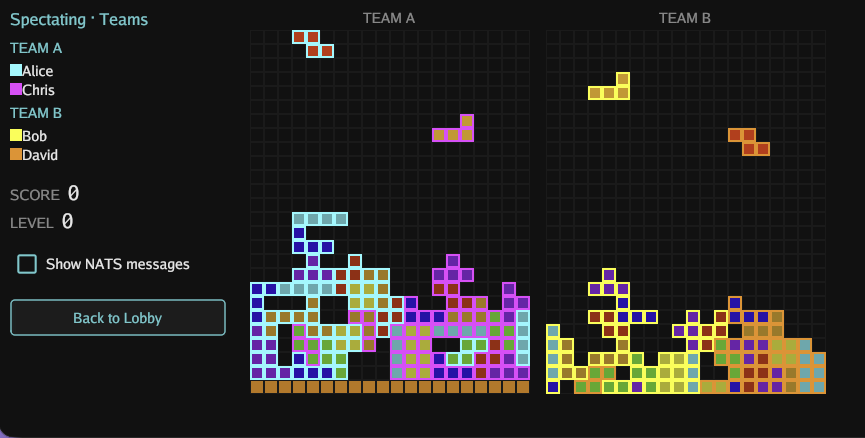

# Jetricks



**An example of a peer-to-peer distributed blackboard system built for humans (or agents) using NATS.io and disguised as a fun real-time, multiplayer, cooperative/competitive Tetris-inspired game**

Let's get the game part out-of-the-way first: Jetricks is a very simple and fun **multiplayer** game. If you know how to play Tetris, then you know how to play Jetricks, but now there are other players that you are playing with or against!

There are 3 game modes: cooperative, competitive, and teams. In cooperative, all the players work with each other to achieve the highest score, in competitive the last player alive wins the game.

To just play the game with others over the Internet, go ahead and download the latest release of the `jetricks` binary for your platform and just run it.

You can then pick which NATS.io server(s) to connect to right : choose one of your NATS CLI contexts from the **Context** pull-down (it starts on your currently selected context), type a server URL into the **NATS URL** field, or select **LAN mode (embedded NATS server)** to have Jetricks start a JetStream-enabled `nats-server` inside the game process itself (no auth, port of your choosing — 4222 by default — storage in a local `jetstream-data` directory) — the window then shows "Your server's URL is `nats://<ip>:<port>`" so you can share it with the people you want to play with, who just type it into their NATS URL field. You can also use any existing JetStream-enabled server or cluster for which you have credentials (using `nats context` to create contexts for those credentials). If you don't have a server to connect to, you can always connect to the NATS.io demo server at `demo.nats.io` with the default port number (4222) — the URL field is pre-filled with it. And start playing (or spectating)!

A note on latency: like all on-line multiplayer video games, the network latency between your machine and the NATS.io server has a noticeable effect on the latency between your player inputs and the playfield you see. Understand that by design in Jetricks there's no client-side pre-updating of what you see on your screen (which is what most Internet multiplayer games do): all your keyboard inputs are published to the server and it's only when the NATS server has persisted the messages associated with your move and then sent them back as updates to your machine that the screen gets updated and shows your move. This by design. The latency that you see on your screen is not just the network latency, it is the end-to-end latency of a transaction getting committed to a stream and stream consumers getting the updated data pushed to them.

now, if you are interested in understanding how Jetricks is implemented and why it's interesting, then please read on.

Every player runs the same desktop binary. That binary is just a NATS client. There is no authoritative server process computing the game: all of the game logic (collision, rotation, gravity, line clears, scoring, the whole lifecycle) runs *inside each player's client*, and the players coordinate purely by reading and writing a shared stream that lives on a NATS server. The NATS server stores and routes messages — it knows nothing about the game.

Since it is a real blackboard system, you are also encouraged to create your own agents (literally, bots) that can play the game against (or with) human players or other agents (there is a default agent included), and even contribute them to this repository. Your agents however need to follow the rules and conventions stated in the Jetricks agent guide. Can your agent(s) top the scoreboard against other agents, or against teams of humans? There is a surprisingly large number of interesting challenges to Jetricks gameplay, especially when you go beyond competitive mode.

---

## Table of contents

1. [The idea: a blackboard system](#1-the-idea-a-blackboard-system)
2. [Why this is hard, and why only NATS does it in one primitive](#2-why-this-is-hard-and-why-only-nats-does-it-in-one-primitive)
3. [Architecture: peers, not clients](#3-architecture-peers-not-clients)
4. [The stream *is* the board](#4-the-stream-is-the-board)
5. [The JetStream features Jetricks uses, and why each is necessary](#5-the-jetstream-features-jetricks-uses-and-why-each-is-necessary)
6. [Walkthroughs with diagrams](#6-walkthroughs-with-diagrams)
7. [Game modes](#7-game-modes)
8. [Build and run](#8-build-and-run)
9. [Watch the blackboard live](#9-watch-the-blackboard-live)
10. [Project layout](#10-project-layout)

---

## 1. The idea: a blackboard system over NATS.io

Jetricks is an example blackboard system, it is a purely 'peer-to-peer' distributed application (on top of NATS): there is no 'game server process' at all, the game is purely executed using the players' `jetricks` processes using the NATS.io server(s) for state storage and synchronization.

A blackboard system is an artificial intelligence approach based on the blackboard architectural model: several independent agents share a common, structured knowledge store — the *blackboard* — that they all read from and write to. No agent owns the whole problem; each watches the blackboard, contributes the changes it can, and reacts to what the others have written. The blackboard is the only thing they share, and it is simultaneously the shared *state* and the shared *communication channel*.

In Jetricks the blackboard is the playfield, stored as a NATS JetStream stream. The agents are the players. Each player drops their own piece onto a board that everyone shares, sees everyone else's pieces in real time, and must never overwrite another player's move.

### The AI analogy

Replace the humans with software agents and nothing about the architecture changes.

Picture a fleet of warehouse robots, each an autonomous agent, packing boxes of various sizes onto the wagons of a train so they fit together perfectly. To do that as a fleet, each robot needs three things from the shared world, at the same time:

- Shared state: a single common picture of where every box already sits (the blackboard). A robot can't plan its placement from a private guess; it has to see the real, current arrangement.
- Concurrency control (CAS): two robots must never drop a box into the same slot. When a robot commits a placement, that commit has to be *conditional* on the slot still being empty; if another robot got there first, the commit must fail so the robot can re-plan, not silently clobber.
- Real-time push: the instant any robot places a box, every other robot that cares must *see it*, immediately, without polling. Their next decision depends on it.

This analogy is exactly what the Jetricks cooperative mode is: a shared board, compare-and-set on every change, and changes pushed to everyone the moment they happen, you can build a multi-agent coordination layer on the same foundation.

---

## 2. Why this is hard, and why only NATS does it in one primitive

The three needs above are each individually well served by various messaging/streaming/data-store systems. The hard part is that a blackboard needs *all three at once, over the same data*. Most stacks force you to bolt two or three systems together and then keep them consistent.

- Plain pub/sub lacks persistence - later joining spectator can't reconstruct the board
- Key/Value stores don't have real-time push to many (or it's a bolted-on channel, not the keyspace itself), and many do not have or have limited per-key CAS.
- Log Streaming systems do not have fine-grained addressing or CAS.
- RDBMS have very limited push ability if any, not distribued and (compared to NATS.io) not 'real-time' and higher latency.

NATS JetStream is the only single system, reached over one connection that checks all the boxes.

A single JetStream stream is *at the same time*:
- the event log (every change, in order),
- the materialized current state (the last message on each subject is that subject's current value), and
- the real-time pub/sub fabric (consumers push new messages to everyone the instant they're written).

And the write path itself carries optimistic concurrency control (per-subject CAS) and atomicity (all-or-nothing batches) - and crucially the two can be combined. The subject hierarchy gives you a separate addressable slot for *every cell of the board* with no "topic explosion" cost, plus wildcard subscriptions so each peer streams exactly the slice of the blackboard it cares about.

That combination is why Jetricks needs no database, no separate cache, no separate message bus, and **no game server** — and why it would be genuinely awkward to build on anything else.

---

## 3. Architecture: peers, not clients

```
        ┌────────────┐      ┌────────────┐      ┌────────────┐
        │  Player A  │      │  Player B  │      │ Spectator  │
        │  jetricks  │      │  jetricks  │      │  jetricks  │
        │   (peer)   │      │   (peer)   │      │   (peer)   │
        │            │      │            │      │            │
        │ game logic │      │ game logic │      │ game logic │
        │  lives     │      │  lives     │      │  lives     │
        │  HERE      │      │  HERE      │      │  HERE      │
        └─────┬──────┘      └─────┬──────┘      └─────┬──────┘
              │   CAS writes  +  pushed messages  (over the stream)
              └────────────────┬─┴────────────────┬──┘
                               ▼                   ▼
                  ┌──────────────────────────────────────┐
                  │              NATS server             │
                  │   JetStream: streams + KV, that's it │
                  │                                      │
                  │   stores messages, enforces per-     │
                  │   subject CAS, pushes to consumers.  │
                  │   knows NOTHING about the game.      │
                  └──────────────────────────────────────┘
```

Every player launches the same `jetricks` binary, which connects to NATS as an ordinary client. To start a multiplayer game you just run more instances pointed at the same NATS server. There is no "host." Each peer:

- runs the complete game simulation locally,
- publishes its own moves as compare-and-set writes to the shared stream, and
- consumes everyone's writes via push consumers and applies them to its local board.

Because the authoritative state is *the stream*, all peers converge on the same board. No peer is in charge; the server arbitrates writes (via CAS) but computes nothing. This is what makes Jetricks genuinely peer-to-peer rather than client-server.

---

## 4. The stream *is* the board

Each game gets its own stream, `JETRICKS_GAME_<gameID>`, capturing the subject space `jetricks.game.<gameID>.>`. The trick is that every cell of the playfield is its own subject, and a subject's *last message* is that cell's *current value*.

```
Stream:  JETRICKS_GAME_<id>          (subjects: jetricks.game.<id>.>)

  subject  (one blackboard slot per cell)              last message = current value
  ─────────────────────────────────────────────       ─────────────────────────────
  jetricks.game.<id>.playfield.cell.7.3          →     { occupied, playerIdx: 0, … }
  jetricks.game.<id>.playfield.cell.7.4          →     { active,   playerIdx: 1, … }
  jetricks.game.<id>.playfield.cell.8.3          →     (never written = empty cell)
  …                                                    …
  ── and, in the SAME stream, the rest of the game state ──
  jetricks.game.<id>.meta                        →     { status: in_progress, seed, … }
  jetricks.game.<id>.events                      →     append-only: line clears, top-outs
  jetricks.game.<id>.roster.<playerID>           →     { name, team, slot }
  jetricks.game.<id>.countdown                   →     { seconds: 3 }
  jetricks.game.<id>.chat                        →     append-only: in-game chat
```

Two things to notice:

1. The cell subjects are key/value-shaped, so "read the board" means "read the last message of each cell subject". A cell that was never written has no message and is simply empty.
2. The append-only subjects (`events`, `chat`) are log-shaped — every message matters and order matters. The *same stream* serves both styles, because a stream is a log and "current value per subject" is just a view over it.

The three game modes use three cell-subject schemes, but the principle is identical:

- Cooperative — one shared board, no player token in the subject: `…playfield.cell.<row>.<col>`. Ownership of a cell lives in the payload (`playerIdx`).
- Competitive — each player owns a private board: `…player.<playerID>.playfield.cell.<row>.<col>`.
- Teams — one shared board per team: `…team.<t>.playfield.cell.<row>.<col>`.

A consumer's subject *filter* then selects exactly the slice a peer wants: its own board, one specific opponent's board, or one team's board — all from the same stream.

---

## 5. The JetStream features Jetricks uses, and why each is necessary

### 5.1 Subject-per-cell with last-message-per-subject (state via subjects)

What: Every board cell is a distinct subject; the latest message on that subject is the cell's current state. Reading the board is "fetch the last message of each cell subject". This also allows the optimization of setting max messages per subject to 1 on the stream with deleting of the old message on update, since in this use case we do not care to keep the history of the values of each cell.

Why it's necessary: The blackboard needs *addressable, overwritable state* — "set cell (7,3) to occupied" — not just an opaque event log. Subject-per-cell gives every slot of the board an independent identity that can be written, overwritten, watched, and compare-and-set individually, while still living inside one ordered stream. It is key/value semantics *and* an event log at once.

### 5.2 Per-subject compare-and-set on publish — the keystone

What: Every gameplay write carries a `Nats-Expected-Last-Subject-Sequence` header. The server commits the message only if the named subject's current last sequence equals the expectation; otherwise it rejects the publish (and therefore if the messages is part of an atomic batch, the whole batch fails).

Why it's necessary: This is what makes a *shared, contended* board safe with no central authority. Two players (or a player's own gravity tick and a line-clear) can target the same cell at the same time. Without CAS, the slower write would silently clobber the faster one and the boards would diverge. With per-subject CAS, a write that was computed from a stale view of a cell is *rejected by the server*, and the peer reacts — drop the move and flash the piece (player input), or refetch-merge-and-retry (engine-driven gravity, spawn, line-clear). Because the expectation is per cell subject, concurrent writes to *different* cells never falsely conflict — only genuine same-cell races do. This single mechanism replaces what would otherwise be a server holding locks.

### 5.3 Atomic batch publish (all-or-nothing multi-cell writes)

What: The stream is created with `AllowAtomicPublish`; a move is published as a single atomic batch (via orbit.go's `jetstreamext` batch publisher), with each message in the batch carrying its own per-subject CAS expectation.

Why it's necessary: One logical move changes several cells at once — the piece's new footprint *plus* the vacated old positions (≈ 4–8 cells). Consumers must *never observe a torn, half-applied piece*. An atomic batch guarantees either every cell of the move commits or none does. And because the batch's *N* messages receive *consecutive* stream sequences, the publisher can infer each cell's assigned sequence from the single commit ack and advance its own CAS bookkeeping immediately — without waiting to see its own write echoed back.

### 5.4 Ordered push consumers + subject filters (real-time delivery to everyone)

What: Each peer runs several *ordered consumers*, each with a subject filter: its own board cells, each opponent's board, the team board, plus `meta`, `events`, `countdown`, `roster`, and lobby `chat`. Messages are pushed in strict stream-sequence order.

Why it's necessary: This is the "push" half of the blackboard — the instant any peer writes a cell, the change is delivered to every peer that subscribed to that slice, with no polling. Ordered consumers guarantee in-order delivery and transparently recover/recreate themselves on hiccups, so each peer can treat its consumer as a clean, gap-free stream of "here's what changed." Subject filters mean a peer subscribes to *exactly* the part of the blackboard it needs (e.g. one opponent's board, or just `meta`) rather than the whole stream.

### 5.5 KV store for the lobby (presence, game listings, and KV-level CAS)

What: The lobby uses a JetStream *KV bucket* (`JETRICKS_LOBBY`). Player presence lives under `players.<id>` (refreshed by a heartbeat, pruned when stale); game listings under `games.<id>`. The lobby `WatchAll`s the bucket for real-time updates, and uses KV compare-and-set (`Update(key, value, revision)`) for join and ready-toggle so concurrent joins can't lose updates or two players claim the same team slot.

Why it's necessary: Lobby state is itself a small shared blackboard: who's online, what games exist, who's ready. KV gives last-value-per-key with a watch (the same push model) and revision-based CAS — and it's the *same* JetStream engine over the *same* connection, so presence, listings, and coordination need no extra infrastructure. A KV bucket is literally a stream with last-value-per-subject and a revision = CAS, which is exactly the blackboard pattern again, one level up.

### 5.6 One stream, many subjects: the whole game in a single stream

What: Cells, `meta`, `events`, `roster.*`, `countdown`, and `chat` all live in the one per-game stream, separated by subject and selected by per-consumer filters.

Why it's necessary: The blackboard is *one* object with several regions. Keeping them in one stream means a single ordered history for the whole game — so, for example, every peer sees elimination `events` in the *same order* and independently reaches the *same* verdict about who won, with no coordinator. Different concerns are just different subject subspaces of the same board.

### 5.7 `meta` as a CAS-guarded lifecycle state machine

What: The game's lifecycle — `created → starting → in_progress → finished → archived` — is a single subject, `…meta`, whose last message is the current status. Every transition is a CAS publish, and transitions retry on CAS failure.

Why it's necessary: Several peers may try to advance the lifecycle at once (e.g. the last two players top out near-simultaneously; both try to mark the game `finished`). CAS on the `meta` subject ensures exactly one transition wins and the rest no-op — distributed agreement on a state machine, again with no elected leader.

### 5.8 Stream lifecycle: seal, delete, and a shared archive stream

What: When a game ends, its result is published to a single shared `JETRICKS_ARCHIVE` stream (which the lobby watches to show recent results), and the per-game stream is then deleted. Startup runs a cleanup pass that reconciles orphaned/abandoned game streams against the lobby KV.

Why it's necessary: Blackboards are created and torn down per task. Sealing freezes a finished game's history; deletion reclaims it. The archive stream is a second, long-lived blackboard of *outcomes*, consumed with the same push model. This keeps resource usage bounded as games come and go.

### 5.9 Bonus: measuring the loop itself (RTT)

Because every visible board change travels the full *write → commit → consume* loop (publish a batch, the server commits it, the ordered consumer delivers it back), Jetricks measures that round-trip continuously and shows it in the HUD. It's not a JetStream feature so much as a window into one: it's the actual latency a player's move pays to become visible to everyone, including themselves.

---

## 6. Walkthroughs with diagrams

### A move: one atomic, CAS-checked batch

A player nudges their piece. The engine diffs the change to just the cells that actually changed, attaches each cell's expected last sequence, and publishes them as one atomic batch:

```
Player A moves left.  Engine diffs → 3 changed cells, each with its expected seq:

      cell 7.3  →  { active A }   expect last seq = 410      (new footprint)
      cell 7.5  →  { empty     }  expect last seq = 409      (vacated)
      cell 7.4  →  { active A }   expect last seq = 412      (commit msg)

        ┌──── atomic batch publish (all-or-nothing) ─────────────┐
        │   msg   cell 7.3   expect 410                          │
        │   msg   cell 7.5   expect 409                          │
        │   commit cell 7.4  expect 412                          │
        └───────────────────────┬────────────────────────────────┘
                                ▼
              server checks EVERY per-subject expectation
                 │
       ┌─────────┴───────────────────────────────┐
       ▼                                          ▼
   all match                                  any stale
   commit → seqs 413,414,415                  reject (10071)
   echoed to EVERY consumer                   move dropped,
   (all peers see the move)                   piece flashes on A's screen
```

### Two peers, one cell: CAS arbitrates

```
   Player A                  cell 7.3  (last seq = 410)             Player B
   ────────                  ──────────────────────────            ────────
   write {A} expect 410 ───►   seq 410 is current    ◄─── write {B} expect 410
                                      │
                         one reaches the server first…
                                      │
                          A wins:  seq → 411, committed
                          and echoed to all consumers
                          (B's consumer applies {A})
                                      │
                          B's write expected 410, but the
                          subject is now at 411  →  10071
                          → B's move is dropped (player input)
                            or refetch-merge-retried (gravity)
```

No lock, no leader — the server's per-subject sequence check is the entire concurrency-control mechanism.

### Joining: snapshot, then resume

```
  Join game
    │
    │ 1. multi-subject direct get: last message of every cell subject,
    │    all bounded to stream sequence S   →  rebuild the full board
    │
    │ 2. ordered consumer, filter = …playfield.cell.>, start = S + 1
    │    every change after the snapshot streams in live
    ▼
  seq:  …  S-2   S-1    S  │  S+1   S+2   S+3  …
        └──── snapshot ────┘  └──── live push ────►
              (state)              (deltas)
```

No update is missed and none is applied twice — the snapshot ends exactly where the live push begins.

---

## 7. Game modes

All three are the same blackboard pattern with different subject schemes and collision rules (full rules: [`jetricks-gameplays.md`](jetricks-gameplays.md)).

- Cooperative: 2+ players share one wide board (`playerCount × 10` columns), each controlling their own piece. Pieces can't overlap; the shared board uses per-cell CAS with merge-retry so neither player ever clobbers the other's in-flight piece. Score is shared.
- Competitive: each player has a private board (their own subject namespace). Clearing lines sends "garbage" rows to opponents (an `events` message they each apply to their own board). Last player standing wins.
- Teams: two teams, each on a shared per-team board (like a cooperative board per side). Line clears attack the opposing team's board; a team loses when all its members top out. The shared `events` stream gives every peer the same elimination order, so all peers agree on the winner without a coordinator.

---

## 8. Build and run

### Prerequisites

- Go 1.25+
- A NATS server with JetStream enabled (e.g. run `nats-server -js` locally, or try demo.nats.io). Native desktop UI builds use [Gio](https://gioui.org); on Linux you'll need its system dependencies (see `.github/workflows/release.yml`).
- Optional: the [`nats` CLI](https://github.com/nats-io/natscli) for managing contexts and inspecting streams.

### Build

```sh
go build -o jetricks ./cmd/jetricks
go build -o jetricks-agent ./cmd/jetricks-agent   # optional: the headless computer player
```

Prebuilt binaries for Linux, macOS, and Windows (amd64 + arm64) are produced on tagged releases by `.github/workflows/release.yml`.

### Run

Jetricks never connects at startup — the login screen is where you choose the connection. Its **CONNECT TO** section offers three options:

- **Context:** a pull-down of your NATS CLI contexts (the same contexts the `nats` CLI uses), preset to your currently selected context — click it to pick another.
- **NATS URL:** an editable URL field, pre-filled with `nats://demo.nats.io:4222`; typing in it selects this option automatically.
- **LAN mode (embedded NATS server):** Jetricks starts a JetStream-enabled `nats-server` inside the game process itself — default account, no auth, JetStream data in a local `jetstream-data` directory — and connects to it. The port is editable (4222 by default; typing in it selects this option), and the screen shows "Your server's URL is `nats://<ip>:<port>`" so you can share the address with other players, who connect to it via their NATS URL field. The server keeps running until you close the window, so quitting to the login screen doesn't kick your friends.

A **Check connection** button dials the current choice and shows the server and its ping without joining anything; hitting **Play** connects and logs in. Quitting the lobby returns to this screen, so you can switch servers without restarting.

The CLI flags don't connect directly either — they only preset the picker:

```sh
# Start with the pull-down on your currently-selected NATS context
./jetricks

# Preset the pull-down to a named context
./jetricks --context my-context

# Preset the URL option to a specific server
./jetricks --server nats://localhost:4222 --user alice --password secret
```

To play multiplayer, **run more instances pointed at the same NATS server** — each instance is one peer. Create a game in the lobby, have the others join it, ready up, and play. A game can be **open** (anyone in the lobby joins it) or **invite-only** — check "Invite only" when creating, then pick who to invite (including specific agents, and per-team in teams mode); invited players get a pop-up to accept or decline, and agents accept automatically.

### Playing with (and against) agents

`jetricks-agent` is a headless computer player that plays **all three modes** — it cooperates on a shared cooperative board, fights for itself in competitive, and holds a seat on a team — using the same engine as the GUI, driven by a placement planner instead of a keyboard, just another peer on the blackboard. Agents are **lobby residents**: point one (or several) at the same server (for LAN mode, the URL shown on the login screen) and it waits in the lobby, joins games that allow agents as they appear, plays, and returns to the lobby for the next one:

```sh
# A resident agent: joins agent-allowed competitive games as they appear, forever
./jetricks-agent --server nats://localhost:4222 --name HAL --difficulty medium
```

Agents wear their identity on their name — `<version>-<instance>-<difficulty>`, e.g. **`mk1-3f7a-medium`**: which agent code generation, which running copy, and how strong. `--name HAL` swaps the version stem, playing as `HAL-3f7a-medium`. You always know what you're up against in the lobby, rosters, and game history.

**You decide per game whether agents may join.** The GUI's competitive create row has an **"Allow agents" checkbox and a max-agents count** (off by default — human-only unless you opt in). Check it, set how many seats agents may take, create the game, and idle agents fill in up to that max; the game row shows `agents 1/2`-style occupancy and agent players are tagged `[agent]` everywhere. The max is enforced atomically, so a crowd of agents can never grab more seats than you allowed.

```sh
# Exit after a single game instead of staying resident
./jetricks-agent --server nats://localhost:4222 --once

# Or have an agent host the game (agent-hosted games allow agents in all seats by default)
./jetricks-agent --server nats://localhost:4222 --create --players 2

# Host a cooperative game and play alongside an agent teammate, or a 2v2 teams game
./jetricks-agent --server nats://localhost:4222 --create --mode cooperative --players 2 --max-agents 1
./jetricks-agent --server nats://localhost:4222 --create --mode teams --players 2
```

In cooperative games agents play for the shared score and treat your falling piece as an obstacle to work around; in teams they take a seat on the emptier team and attack the other board like any teammate would.

`--difficulty` is `easy`, `medium`, or `hard` (default): easy and medium think slower and sometimes blunder; hard plays the best move it can find as fast as the round-trips allow. Agents are held to a **fair-visibility contract**: they decide only on what a human player can see in the UI — the committed boards, the roster, the score — never the RNG seed or upcoming pieces. `--join <gameID>` targets a specific game (still subject to its agent policy); run two resident agents and create a agents-only game to spectate an agent-vs-agent match. See `jetricks-agent -h` for the full flag list and [`jetricks-gameplays.md`](jetricks-gameplays.md) §11 for how it plays.

**Want to build your own agent?** The playfield is a blackboard and agents are just peers — humans included. There is no framework to plug into: an agent is any program that speaks the game's NATS protocol and follows the fair-play rules, in **any language**. [`jetricks-agent-guide.md`](jetricks-agent-guide.md) is the complete wire contract, and [`agents/README.md`](agents/README.md) is where you submit your own. The shipped `jetricks-agent` (`mk1`) is the Go reference implementation you can play against.

### Clean up

A finished game tidies up after itself, but to wipe *all* Jetricks streams and KV buckets from a server:

```sh
./scripts/cleanup.sh                 # uses the selected NATS context
./scripts/cleanup.sh --context my-context
```

---

## 9. Watch the blackboard live

In a game, toggle "Show NATS messages" to open a panel that prints, in real time, every message this peer's consumers deliver — the stream timestamp, the subject, and the JSON payload. It's the blackboard, live: you can literally watch cell writes, `meta` transitions, line-clear `events`, and countdowns flow past as you and the other players move. *Code:* `internal/nativeui/natslog.go`.

---

## 10. Project layout

```
cmd/jetricks/          entry point: connect to NATS, ensure lobby streams/KV, launch UI
cmd/jetricks-agent/      headless computer player for competitive mode (CLI, no UI)
internal/
  nats/                the JetStream layer — streams, KV, CAS publish, atomic batches,
                       ordered consumers, multi-subject direct get  ← start here
  config/              subjects, stream/KV names, game metadata types
  game/                pure Tetris rules: pieces, rotation (SRS), collision, line clears
  engine/              per-player game loop: publishes moves as CAS batches, consumes
                       everyone's writes, drives gravity, detects lock-in / line clears
  lobby/               lobby over KV: presence (heartbeat), game listings, join/ready (CAS)
  rng/                 seedable 7-bag piece randomizer (deterministic across peers)
  archive/             record a finished game, seal/delete its stream
  cleanup/             startup reconciliation of orphaned/abandoned game streams
  agent/                 the computer player: placement planner (Dellacherie
                       heuristic), sense–act move executor, lobby orchestration
  nativeui/            native Gio desktop UI (board, lobby, live NATS-message panel)
```

For the full design, see the companion documents:

- [`jetricks-gameplays.md`](jetricks-gameplays.md) — authoritative gameplay rules
- [`jetricks-project-structure.md`](jetricks-project-structure.md) — architecture and package design
- [`jetricks-implementation-plan.md`](jetricks-implementation-plan.md) — implementation plan
- [`jetricks-agent-guide.md`](jetricks-agent-guide.md) — how to build your own jetricks-playing agent

---

*Jetricks is a demonstration that the blackboard pattern — shared state, optimistic concurrency control, and real-time push, over one substrate — is a first-class thing you can build directly on NATS JetStream. The players happen to be human and the task happens to be multi-player Tetris; swap in software agents and a coordination task, and the architecture is unchanged. `jetricks-agent` is that swap made literal: a software agent that joins the same games through the same blackboard, with not one line of the protocol changed to accommodate it.*
